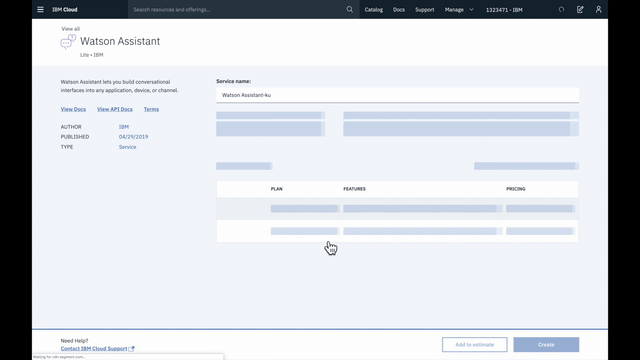
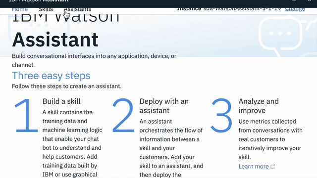

# Watson Assistant 101

In this Learning-Thingy we'll start from scratch to build a chatbot using IBM Watson Assistant

Here's an overview to explain what we'll accomplish:

[![video overview]](https://ibm.box.com/s/8rk5zczhxlheflp21uza8495lyxnbbat)

## Getting Started with Watson Assistant

[![video_Get_Started]](https://ibm.box.com/s/tzvm3mbmpjdyma6otbc8gtujobtqoehq)

* You'll need to [create a service instance for Watson Assistant](https://cloud.ibm.com/catalog/services/watson-assistant) as the first step.
* Create a Skill, go to the Content Catalog, and add `Customer Care`.

* Next, add an Assistant and connect the Skill.
* Use the `Integrations` button to get a preview and test in a browser.

